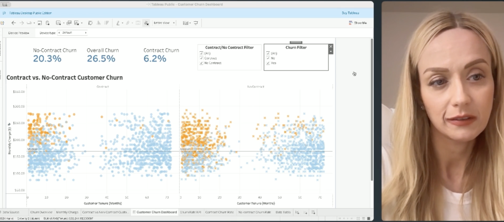

# 📊 Customer Churn Analysis Dashboard (Tableau)

---

# Project Overview

This project analyzes customer churn patterns using **Tableau** to identify the key factors associated with customer attrition. The interactive dashboard enables users to explore churn trends across different customer segments, contract types, and service characteristics.

Understanding why customers leave helps organizations develop targeted retention strategies, improve customer satisfaction, and increase long-term customer value.

---

# Business Question

**Which customer characteristics and service factors are most strongly associated with customer churn?**

---

# Skills Demonstrated

- Interactive Dashboard Design
- Data Visualization
- Customer Segmentation
- Business Intelligence
- Churn Analysis
- KPI Development
- Tableau
- Business Analytics

---

# Technologies

- Tableau
- Data Visualization
- Business Intelligence
- Dashboard Development

---

# Dashboard Features

The dashboard enables users to:

- Explore churn rates across multiple customer attributes
- Filter results by contract type, tenure, and service features
- Identify high-risk customer groups
- Compare churn across customer segments
- Investigate patterns that may inform customer retention strategies

Interactive filters allow analysts and business stakeholders to quickly explore different customer segments and uncover trends in churn behavior.

---

# Repository Contents

- **Customer Churn Dashboard_D601.twbx**
  - Tableau packaged workbook containing the dashboard and dataset

- **Customer Churn Dashboard Instructional.docx**
  - Documentation describing the dashboard design and analytical methodology

---

# Dashboard Preview

---

# 🎥 Project Walkthrough

A complete walkthrough of the Tableau dashboard is available on Vimeo. The presentation demonstrates the dashboard layout, interactive filtering capabilities, key visualizations, and business insights related to customer churn.

▶️ **Watch the Project Presentation**

https://vimeo.com/1160010738

---

# Key Insights

The analysis demonstrates that customer churn is associated with several customer and service characteristics, including:

- Contract type
- Length of customer tenure
- Service usage patterns
- Customer segmentation

These insights can help organizations identify at-risk customers and develop targeted retention strategies.

---

# Business Value

This dashboard supports data-driven decision making by helping organizations:

- Identify customers at risk of churning
- Develop targeted retention campaigns
- Monitor churn across customer segments
- Improve customer lifetime value
- Support strategic business planning

---

# Author

**Joanna Ronchi**

- Master of Science in Data Science
- Bachelor of Science in Information Technology Management

GitHub: https://github.com/joannar77
